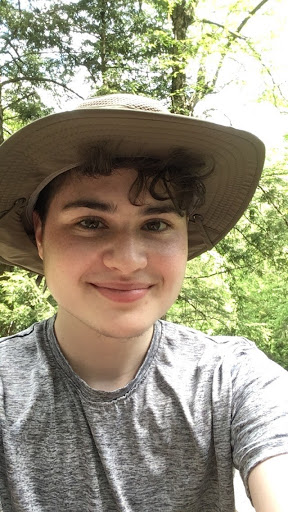

# WebProgramming2021
Main Project

## Self Introduction

My name is Jay Porcelli and my pronouns are they/them. I’m an English major with minors in Computer Science and Philosophy, and I’m a senior who will be graduating in Spring 2022. I started out as a CS major because my parents (who are both programmers) wanted me to do something practical, but by the end of freshman year I realized I wanted to be an English major. I stopped taking CS and math classes for a few years, until I took the philosophy class Symbolic Logic. In order to learn more about logic, I decided to take more math and CS classes, which brought me right back where I started. I realized that without outside pressures and expectations, I actually like computer science. While I don’t have as much coding experience as many of the other people in this class, I do have some experience. In high school I took an intro to programming class and learned Python, and in my freshman year of college I took CS1 and CS2. Last semester, I took Discrete Math for Computing and CS3. I learned basic web programming in CS3.

I don’t plan on going into the CS field after graduation, so I’m not sure exactly how I will use this class in the future, but I still think web programming (and coding in general) is a really good skill to have. I’m taking this class because I want to learn about web programming, not for the grade. Even though I am taking this class “for fun,” I know that I will need to put in a lot of effort, especially since I don’t have a lot of coding experience. My goal for this class is to understand web programming enough to be able to do it on my own if it comes up in the future, either as a personal project or something career related.

